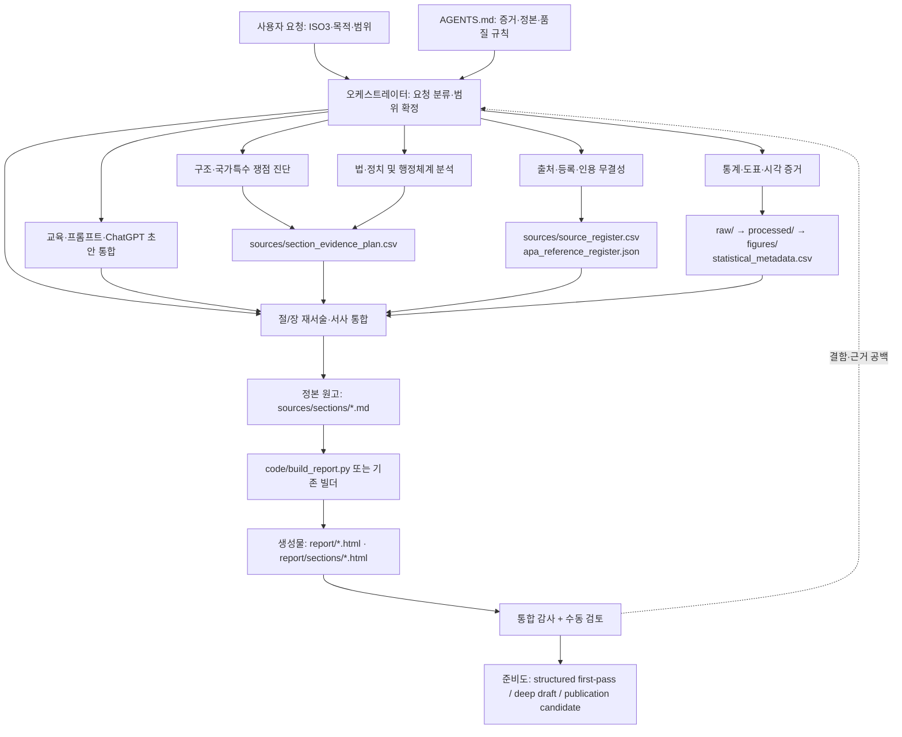

# GDI Country Studies Agent: 통합 아키텍처 청사진

## 1. 목적과 설계 범위

이 문서는 `country-report-agent`를 여러 작업 패턴이 함께 작동하는 **통합 증거-제작 시스템**으로 정의한다. 현재의 단일 `SKILL.md`와 `references/`를 대체하거나 실행 중인 하위 에이전트를 새로 만들지 않는다. 대신 요청을 어떤 기능 모듈로 라우팅하고, 어떤 파일을 정본으로 취급하며, 어떤 검증을 거쳐 다음 작업으로 넘길지를 명시한다.

공개 시리즈명은 **GDI Country Studies**이다. `[ISO3]/sources/sections/*.md`는 정본 원고이고, `[ISO3]/report/`는 빌드 산출물이다. `raw/`는 보존 원자료이므로 명시적 요청 없이 수정하지 않는다.

## 2. 운영 원칙과 경계

| 층 | 책임 | 권한과 금지 |
|---|---|---|
| 프로젝트 규칙 (`AGENTS.md`) | 정본 위치, 증거 기준, 시리즈명, 품질 문턱 | 모든 모듈에 우선한다. 생성 HTML만 고치는 방식과 근거 없는 사실·인용·수치 생성을 금지한다. |
| 오케스트레이터 (`SKILL.md`) | 요청 분류, 모듈 선택, 작업 순서, 최종 보고 | 진단을 기본값으로 하며, 범위를 요청한 국가·장·절로 제한한다. |
| 하위 기능 모듈 | 구조, 출처, 통계, 원고, 법·정치, 행정, 검증, 교육 | 각 모듈은 아래 계약표의 입력·출력·검증 조건을 충족해야 한다. |
| 참조 프로토콜 (`references/`) | 분석·서술·등록·감사의 세부 기준 | 프로토콜은 지식 근거이며, 독자용 원고에 작업지시문이나 감사표를 그대로 노출하지 않는다. |
| 저장소·빌드 계층 | 원자료 보존, 파생자료·도표 생성, HTML 렌더링 | 코드 또는 정본 원고를 먼저 고치고 재빌드한다. 빌드가 관련 없는 내용을 손상하면 게시용 결과를 교체하지 않는다. |

## 3. 정본 데이터 흐름

## 4. 기능 모듈과 참조 프로토콜의 대응

| 기능 모듈 | 주된 책임 | 필수/주요 참조 프로토콜 |
|---|---|---|
| 1. 구조·쟁점 진단 | 폴더 완전성, 1–19장, 국가특수 쟁점의 필요성과 배치 | `report_structure.md`, `country_specific_issue_protocol.md` |
| 2. 출처·등록·인용 | 출처 역할, APA 추적성, 레지스터와 본문 연결 | `source_quality_rules.md`, `reference_schemas.md`, `citation_reference_integrity.md` |
| 3. 통계·시각 증거 | 수집, 메타데이터, 가공, 분석, 도표 및 본문 해석 | `statistical_analysis_protocol.md`, `international_statistics_toolkit.md` |
| 4. 원고·서사 | 절과 장의 주장·근거·한계·함의를 자연스러운 책 문체로 통합 | `section_rewrite_protocol.md`, `narrative_style_protocol.md`, `chapter_coherence_protocol.md` |
| 5. 법·정치 및 행정 | 법적 지위와 실제 이행을 분리하고, 권한·재정·인사·정보·책임 회로를 분석 | `legal_political_chapter_protocol.md`, `administrative_chapter_protocol.md` |
| 6. 외부 초안·교육 | ChatGPT 초안을 검증 가능한 원고 입력으로 전환하고, 학습자용 과제를 설계 | `chatgpt_draft_integration.md`, `student_practice_mode.md`, `prompt_templates.md` |
| 7. 품질 게이트·산출 형식 | 감사 결과를 우선순위와 정직한 준비도로 번역 | `quality_gate.md`, `output_templates.md` |

## 5. 표준 작업 순서

1. **수신·식별** — ISO3, 요청 유형, 대상 파일·장·절, 변경 허용 범위를 확인한다.
2. **진단·계획** — 현존 정본, 강한 국가특수 근거, 누락된 출처·데이터·구조를 확인하고 `section_evidence_plan.csv`에 연결한다.
3. **증거 확보·등록** — 원자료는 `raw/`에, 파생자료는 `processed/`에 두고 출처·지표·참조 식별자를 등록한다.
4. **분석·원고 수정** — 검증된 증거만으로 `sources/sections/*.md`를 범위 내에서 수정한다. 법·정치, 행정, 통계, 국가특수 모듈은 필요한 경우 병행하되 동일한 주장에 서로 다른 사실을 덮어쓰지 않는다.
5. **빌드·자동 감사** — 기존 빌더를 실행하고, 요청에 맞는 감사 스크립트를 돌린다. 자동 감사는 선별 도구이며 수동 판단을 대체하지 않는다.
6. **수동 검토·인계** — 인용 링크, 수치, 표·그림, 장 간 연결, 생성물 보존을 점검하고 준비도와 남은 위험을 보고한다.

## 6. 모듈 간 공통 계약

### 공통 입력 식별자

모든 모듈은 가능한 경우 `country_code`, `section_id`, `source_id`, `reference_id`, `indicator_id`, `chart_id`를 사용한다. 식별자가 아직 없으면 새 값을 임의로 본문에만 만들지 말고 레지스터 또는 증거계획에 먼저 기록한다.

### 공통 산출 상태

모든 조사·감사 결과는 `verified`, `partially_verified`, `needs_verification`, `rejected`, `superseded` 중 하나의 검증 상태를 가진다. 결측, 차단, 단위 불일치, 불확실한 인용은 0 또는 사실로 대체하지 않는다.

### 공통 불변조건

- 원고의 국가특수 기관·법·개혁·지역·논쟁을 일반 템플릿 문장으로 지우지 않는다.
- 모든 중요 수치에는 값, 연도/기간, 단위, 적용 범위, 출처기관, 지표·표 식별자를 연결한다.
- 수치·APA 인용·최종 참고문헌·레지스터·로컬 원천기록은 서로 추적 가능해야 한다.
- 최종 HTML은 Markdown/빌드 파이프라인의 결과여야 한다. 링크 수정도 가능한 한 정본 빌더에 반영한다.
- 완료 보고에는 변경 파일, 실행·검토한 검증, 정직한 준비도, 남은 근거·편집 위험을 포함한다.

## 7. 준비도 의사결정

| 상태 | 진입 조건 | 아직 할 수 없는 주장 |
|---|---|---|
| `structured first-pass` | 기본 장 구조와 일부 원고·HTML이 존재 | 완성된 책 또는 출판 준비 완료 |
| `deep draft` | 실질적 국가특수 논증, 검증된 근거, 데이터집약 장의 통계 통합, 자연스러운 서사 | 외부 검토 없이 즉시 출판 가능 |
| `publication candidate` | 고위험 장(3·5·7·16·17), 공식 출처, 인용·참고문헌, 통계·시각 증거, 수동 감사를 상당 부분 해결 | 무검토·무제한의 사실 확정 |

자동 감사의 통과는 위 상태를 단독으로 부여하지 않는다. 특히 국가특수 쟁점, 인과 해석, 법적 지위와 실제 이행의 구분, 서사적 응집성은 수동 검토가 필요하다.

## 8. 구현 상태와 다음 단계

이 청사진은 현재 `SKILL.md`의 작업 패턴과 `references/`를 문서상 하위 기능 모듈로 정렬한다. 다음 문서인 `SUBSKILL_IO_CONTRACTS.md`가 각 모듈의 구체적인 입출력, 허용 변경, 검증, 인계 조건을 계약표로 고정한다. 실제로 독립 하위 에이전트를 실행하려면, 그 후에 각 계약을 별도의 `SKILL.md` 또는 오케스트레이터 라우팅 규칙으로 구현해야 한다.
