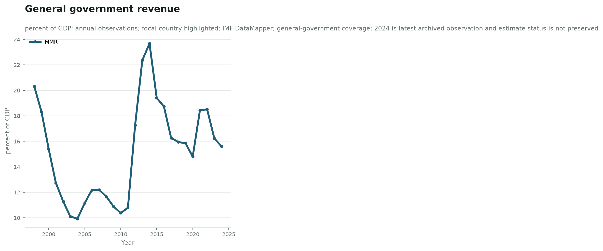
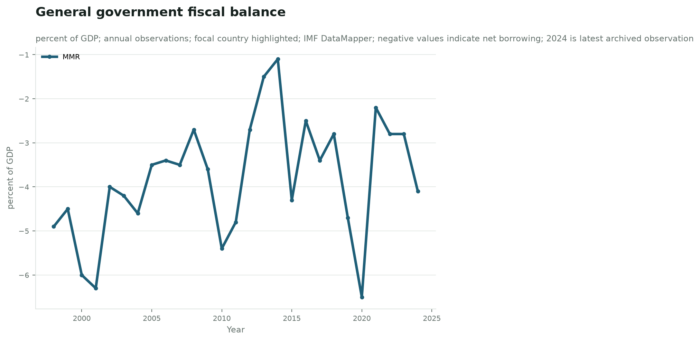
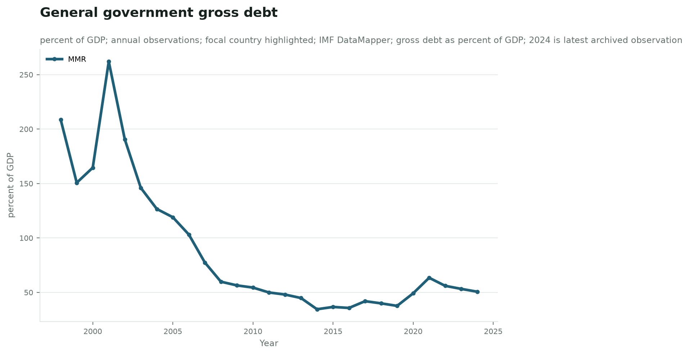
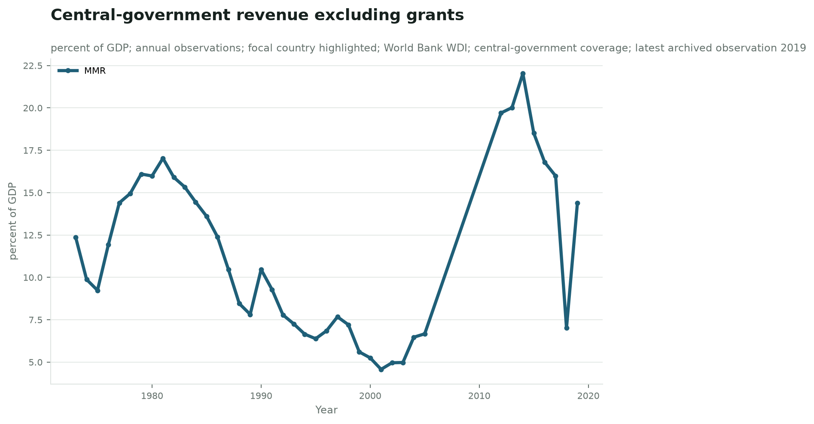
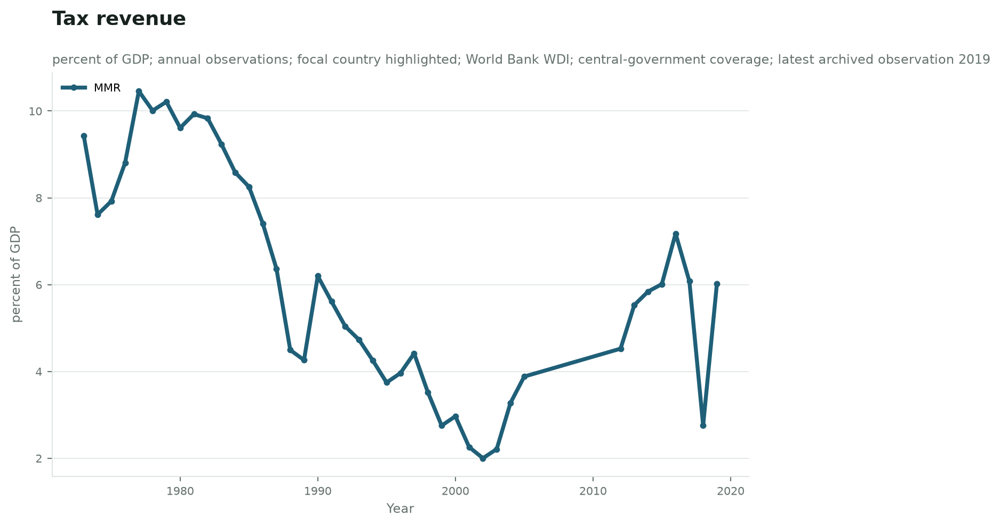
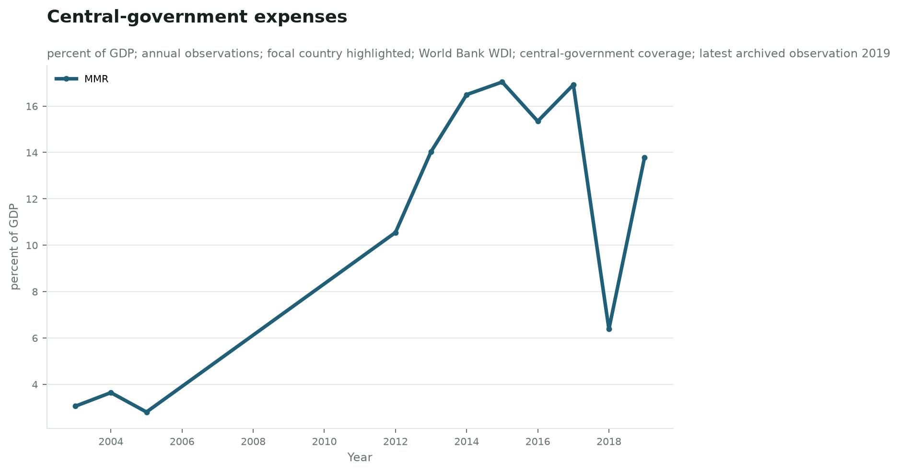
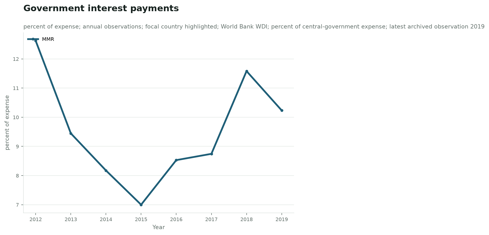

# Chapter 7 Statistical Appendix: Fiscal System and Public Sector

This appendix uses existing archived international fiscal series to show level and trend. IMF general-government and World Bank central-government measures are kept separate. Values are descriptive evidence and do not replace national budget documents or establish conflict-related fiscal flows.

## General-Government Fiscal Envelope

IMF general-government series show the broad fiscal envelope but retain estimate/projection and coverage limitations.

### General government revenue

MMR records 15.6 percent of GDP in 2024. The earliest available value in this run is 20.3 in 1998, a change of -4.70 percent of GDP. This is a descriptive comparison; different latest years and source-specific estimation methods require caution.

Source: International Monetary Fund; IMF DataMapper fiscal series; indicator rev; unit: percent of GDP. Limitation: Do not treat as audited national accounts; general-government coverage differs from World Bank central-government series.

### General government fiscal balance

MMR records -4.1 percent of GDP in 2024. The earliest available value in this run is -4.9 in 1998, a change of +0.80 percent of GDP. This is a descriptive comparison; different latest years and source-specific estimation methods require caution.

Source: International Monetary Fund; IMF DataMapper fiscal series; indicator GGXCNL_NGDP; unit: percent of GDP. Limitation: Negative values indicate net borrowing in the source series; latest values require estimate/projection qualification.

### General government gross debt

MMR records 50.6 percent of GDP in 2024. The earliest available value in this run is 208.6 in 1998, a change of -158.00 percent of GDP. This is a descriptive comparison; different latest years and source-specific estimation methods require caution.

Source: International Monetary Fund; IMF DataMapper fiscal series; indicator GGXWDG_NGDP; unit: percent of GDP. Limitation: Debt concept is general-government gross debt and must not be substituted for central-government debt.

## Central-Government Fiscal Indicators

World Bank central-government indicators provide a separate historical layer and end in 2019 in the archived package.

### Central-government revenue excluding grants

MMR records 14.4 percent of GDP in 2019. The earliest available value in this run is 12.4 in 1973, a change of +2.02 percent of GDP. This is a descriptive comparison; different latest years and source-specific estimation methods require caution.

Source: World Bank; World Development Indicators; indicator GC.REV.XGRT.GD.ZS; unit: percent of GDP. Limitation: Central-government coverage; latest archived observation is 2019.

### Tax revenue

MMR records 6.0 percent of GDP in 2019. The earliest available value in this run is 9.4 in 1973, a change of -3.41 percent of GDP. This is a descriptive comparison; different latest years and source-specific estimation methods require caution.

Source: World Bank; World Development Indicators; indicator GC.TAX.TOTL.GD.ZS; unit: percent of GDP. Limitation: Central-government coverage; latest non-missing archived observation is 2019.

### Central-government expenses

MMR records 13.8 percent of GDP in 2019. The earliest available value in this run is 3.1 in 2003, a change of +10.72 percent of GDP. This is a descriptive comparison; different latest years and source-specific estimation methods require caution.

Source: World Bank; World Development Indicators; indicator GC.XPN.TOTL.GD.ZS; unit: percent of GDP. Limitation: Central-government coverage; latest non-missing archived observation is 2019.

### Government interest payments

MMR records 10.2 percent of expense in 2019. The earliest available value in this run is 12.6 in 2012, a change of -2.39 percent of expense. This is a descriptive comparison; different latest years and source-specific estimation methods require caution.

Source: World Bank; World Development Indicators; indicator GC.XPN.INTP.ZS; unit: percent of expense. Limitation: Interest burden is a share of central-government expense; latest non-missing archived observation is 2019.

## Core coverage audit

Overall status: **pass**.

| Domain | Status | Available / minimum | Missing indicators | Rationale |
|---|---|---:|---|---|
| General-government fiscal capacity | pass | 3 / 3 | None | The reproducible IMF archive supports revenue, fiscal balance and gross debt; expenditure remains unresolved because its raw payload is unavailable. |
| Central-government fiscal capacity | pass | 4 / 4 | None | Central-government revenue, tax effort, expense and interest burden provide a separate historical coverage layer. |
