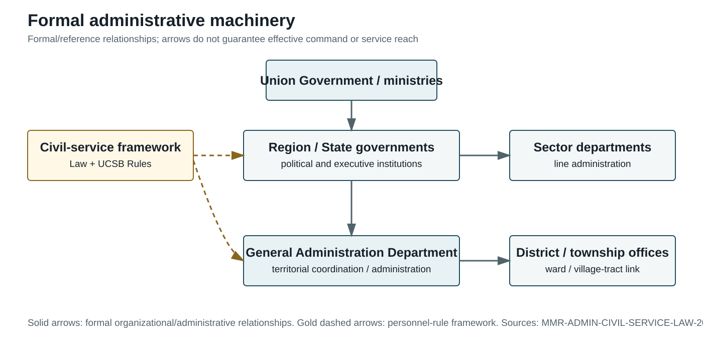

## 5.1 Central Government and Core Coordinating Institutions

### 5.1 Formal Union Government and Administrative Machinery

Myanmar's formal administrative machinery is organized through a Union system whose constitutional design combines central executive authority with limited subnational government. The 2008 Constitution establishes Union ministries and Union-level offices, while the Civil Services Personnel Law defines the personnel organizations through which ministries and other public bodies are staffed. The 2013 law covers ministries of the Union Government, Region or State governments and self-administered areas, and defines the head of a service-personnel organization as a person appointed by the President. It also excludes Defence Services personnel and members of the Police Force from the law's civil-service regime (Union Civil Services Board, 2013, pp. 3-4). This is a legal boundary, not a claim that military or police institutions are administratively irrelevant.

The formal machinery therefore has at least two distinct layers. One is the constitutional and political layer: the President, Union Government, Union ministers and the Region or State governments exercise powers assigned by the Constitution and laws. The other is the personnel and departmental layer: ministries and service organizations recruit, deploy, supervise and discipline staff through the civil-service framework. These layers overlap in practice but are not identical. A ministry's constitutional existence does not by itself show that its instructions reach every township, nor does an office's presence prove that it can perform all of its assigned functions under conflict conditions.

The Civil Service Personnel Rules make this administrative machinery more concrete. The Rules were issued by the Union Civil Service Board as Notification No. 12/2014 under section 76(a) of the Civil Service Personnel Law and apply to service personnel paid from the State Budget; they again exclude defence personnel and the Myanmar Police Force (Union Civil Service Board, 2014, p. 9). They specify routes for gazetted-officer selection, external appointment, transfer, promotion, training and disciplinary action. For example, gazetted-officer posts are initially selected by the Union Civil Service Board, while ministries and service organizations submit proposals for specified appointments and promotions (Union Civil Service Board, 2014, pp. 15-20). The rules thus describe a personnel-control circuit, but they do not measure whether recruitment, supervision or discipline operated consistently after 2021.

Formal machinery has also been reorganized through executive action. A Ministry of Information report dated 1 August 2021 records the State Administration Council's Order No. 149/2021, which reconstituted the Ministry of the Union Government Office as two ministries and invoked Constitution section 419 (State Administration Council, 2021). This is evidence of an official restructuring claim. The report does not, by itself, establish the staffing, budget, information flows or territorial implementation that followed. The reorganization is therefore a formal post-2021 arrangement, while its implementation remains a separate evidentiary question.

*Figure. Formal administrative machinery. Source basis: MMR-LEGAL-CONST-2008; MMR-ADMIN-SAC-ORDER-149-2021. Reference period: constitutional design and 1 August 2021 official restructuring claim. Caveat: formal arrangement only; not evidence of nationwide effective reach.*

