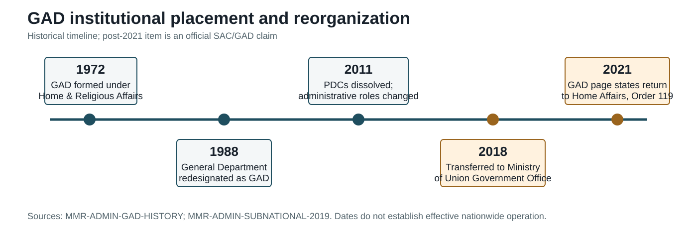

## 5.2 Organizational Management and Bureaucratic Reform

### 5.2 General Administration Department and Territorial Administration

The General Administration Department is the most important institution for explaining how Myanmar's formal administrative chain extends below the Union and Region/State levels. The GAD's own institutional history describes a long administrative lineage, including commissioner, deputy commissioner, sub-divisional officer and township officer posts before 1972, a distinct GAD structure formed under the Ministry of Home and Religious Affairs in 1972, and later changes in the names and placement of subnational offices (General Administration Department, n.d.). This historical account is useful for identifying institutional continuity, but it is an official account rather than independent proof of performance.

The same page states that GAD offices operate through a Head Office, Nay Pyi Taw, Region/State, self-administered, district, township, town and ward/village-tract levels. It lists functions including general administration, community peace and rule of law, land administration, tax collection, town and village formation and rural development (General Administration Department, n.d.). These functions show why GAD is more than an ordinary line department: it links territorial administration, coordination and selected regulatory tasks. They do not show that GAD currently performs each function uniformly nationwide.

The GAD history identifies two important placement changes. It states that GAD was transferred and reorganized under the Ministry of the Office of the Union Government on 28 December 2018, following Government Meeting No. 23/2018, and that it was transferred back to the Ministry of Home Affairs effective 5 May 2021 under SAC Order No. 119/2021 and Constitution article 419 (General Administration Department, n.d.). The first date and the second date are therefore supported as official institutional claims. The underlying 2018 and 2021 instruments remain absent from the archive, so these claims are not presented as fully verified legal history.

The pre-2021 administrative chain is documented more independently in two governance studies. The 2014 GAD study describes GAD as the civil service for the new State and Region governments and as the administration for districts and townships, with structures and functions at State/Region, district, township, ward and village-tract levels (Kyi Pyar Chit Saw & Arnold, 2014, pp. 1, 26-38). The Asia Foundation's 2019 study describes a system in which States and Regions have elected hluttaws and executive governments, while below that level there is no third tier of elected local government. Instead, departments and committees operate through a graded territorial administration, with GAD offices and township administrators playing major coordination roles (The Asia Foundation, 2019, pp. 11-13, 58-64).

This distinction is central. Region/State Hluttaws are political institutions; GAD offices and township administration are bureaucratic machinery. Districts, townships, wards and village tracts are territorial and administrative units, but they are not automatically equivalent to autonomous elected governments. The formal chain is therefore represented as a set of relationships among Union ministries, Region/State governments, GAD offices, sector departments and local administrators rather than as a simple federal hierarchy.

*Figure. GAD institutional placement timeline. Source basis: MMR-ADMIN-GAD-HISTORY. Reference period: pre-1972, 1972, 28 December 2018 and 5 May 2021 as stated in the official institutional history. Caveat: institutional-placement history does not establish current performance.*

