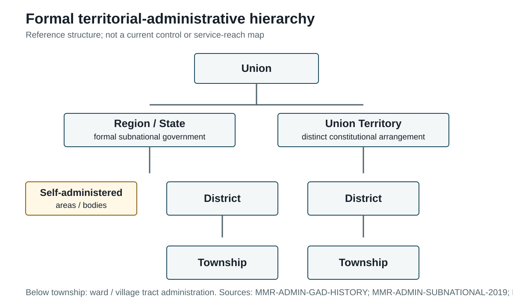

## 5.5 Local Administration and Service Delivery

### 5.5 Administrative Capacity, Reach, and Service-Delivery Implications

Administrative capacity in Myanmar is best assessed as a relationship between formal design and effective reach. The Constitution and civil-service framework establish offices, responsibilities and personnel procedures. GAD history and pre-2021 governance research explain the intended chain from Region/State administration through district and township offices to wards and village tracts. Post-2021 evidence is needed to determine where that chain remains operational, where it is contested and where services are delivered through parallel or negotiated arrangements.

This approach also limits claims about service delivery. GAD's formal objectives and historical functions do not prove current delivery of education, health, humanitarian or local-government services. Those sectors require their own evidence. The organizational consequences remain analyzable: fragmented authority can make personnel deployment, budget execution, information reporting, complaint handling and interdepartmental coordination less predictable. The 2019 pre-coup evidence on dual accountability provides a baseline for understanding why conflicting instructions can matter; post-2021 evidence must then show whether and how those problems have changed.

The pre-2021 planning and budgeting evidence illustrates the mechanism without being mistaken for current practice. The Asia Foundation describes township-level proposals moving through planning committees, review by State/Region planning and budget departments, and coordination among departments and GAD-linked local bodies (The Asia Foundation, 2019, pp. 67-72). This example shows how information, priorities and resources travelled through the administrative system before 2021. It does not establish that the same circuit continues to operate under conflict conditions. For the post-2021 period, the decisive questions are which actor receives the proposal, who controls funds, who supplies staff, and how implementation is checked.

The resulting account is more precise than a simple contrast between a functioning state and state absence. Myanmar may retain formal offices and legal personnel rules while experiencing interrupted reporting, competing instructions, staff displacement or parallel service arrangements. The analytical object is the changing relationship between institutional presence and administrative performance. Evidence that identifies only a formal office supports a claim of formal presence. UN reporting of a local service or governance arrangement must be read with its locality, date and actor. Where neither form of evidence is available, the claim remains unresolved.

The conclusion is necessarily qualified. Myanmar has a documented formal Union and subnational administrative machinery, with GAD historically occupying a coordinating and territorial role and the civil-service laws setting out personnel procedures. Since 2021, however, the evidence supports a differentiated picture of formal restructuring, contested authority and uneven administrative reach rather than a single effective nationwide system. Further analysis depends on connecting dated local observations to the relevant authority, personnel, resource and service-delivery circuits rather than drawing an unsupported control map.

*Figure. Formal territorial-administrative hierarchy. Source basis: MMR-LEGAL-CONST-2008; MMR-ADMIN-SUBNATIONAL-2019. Reference period: formal administrative design and pre-2021 baseline. Caveat: hierarchy does not imply effective territorial control or uniform service delivery.*

