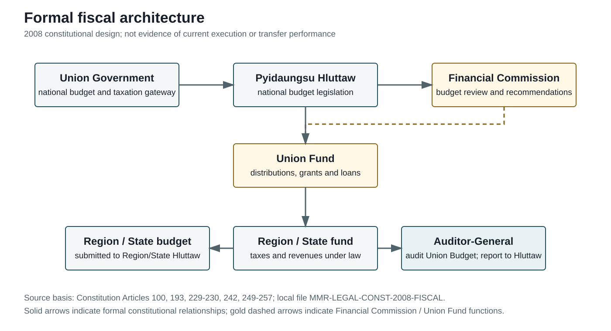

## 7.1 Government Revenue, Tax Revenue, and Expenditure Structure

### 7.1 Fiscal Institutions and Budget Architecture

Myanmar's formal fiscal system begins with a constitutional division between Union-level fiscal authority and Region/State budget responsibilities. Article 100(b) of the 2008 Constitution assigns the Union Government the exclusive right to submit bills concerning national plans, annual budgets and taxation to the Pyidaungsu Hluttaw (Republic of the Union of Myanmar, 2008, PDF p. 43). This provision identifies the Union as the central legislative and executive gateway for national fiscal policy. It does not by itself establish how budgets are debated, executed or audited under changing political conditions.

The Constitution also provides a formal subnational fiscal layer. Article 193 states that Region/State annual budget bills are submitted by the relevant Region/State Government to its Hluttaw, and that the budget may include finance received from the Union Fund as well as debt-related expenditures (Republic of the Union of Myanmar, 2008, PDF pp. 78-79). Articles 249-253 connect Region/State executive responsibilities to projects, laws and an annual budget based on the Union budget. Articles 254-257 provide for Region/State taxes and revenues to be deposited in a Region/State fund, and allow Region/State governments to supervise departments and, with prior coordination with the Union Government, form civil-service organizations and appoint personnel (Republic of the Union of Myanmar, 2008, PDF pp. 110-112).

The intergovernmental mechanism is the Financial Commission. Articles 229-230 place the President, Vice-Presidents, Attorney-General, Auditor-General, Region/State Chief Ministers, Nay Pyi Taw Council Chairperson and Union Finance Minister within the Commission's formal structure. Its functions include reviewing Union and Region/State estimated budgets, recommending the Union Budget, distributing suitable funds from the Union Fund, and recommending special grants and loans (Republic of the Union of Myanmar, 2008, PDF pp. 92-93). This is a constitutional architecture for intergovernmental finance, not evidence that transfers are predictable, adequate or transparently executed.

The Constitution also provides for external audit. Article 242 describes the Auditor-General of the Union as an office appointed to audit the Union Budget and report to the Pyidaungsu Hluttaw (Republic of the Union of Myanmar, 2008, PDF p. 104). The legal existence of the office is distinct from audit independence, publication, follow-up and actual scrutiny. Those performance questions require audit reports and institutional records that are not yet in the local Chapter 7 evidence package.

The formal fiscal architecture can therefore be summarized as a chain: Union Government and Pyidaungsu Hluttaw at the national budget gateway; Financial Commission review and Union Fund distribution; Region/State budgets and funds; and an Auditor-General responsible for reporting on the Union Budget. The chain is sufficiently documented as de jure design. Its operation after 2021 remains a separate empirical question.

*Figure. Formal fiscal architecture. Source basis: MMR-LEGAL-CONST-2008-FISCAL. Reference period: 2008 constitutional design. Caveat: formal de jure structure only; it does not show current budget execution or fiscal reach.*

