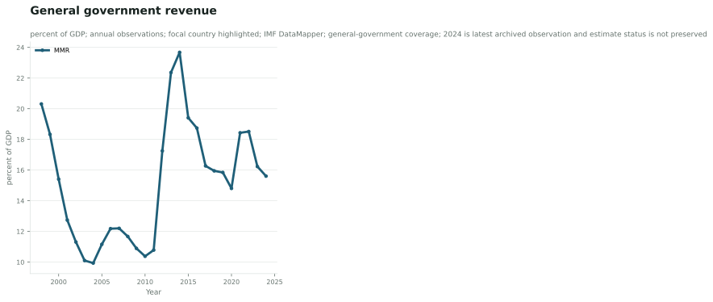
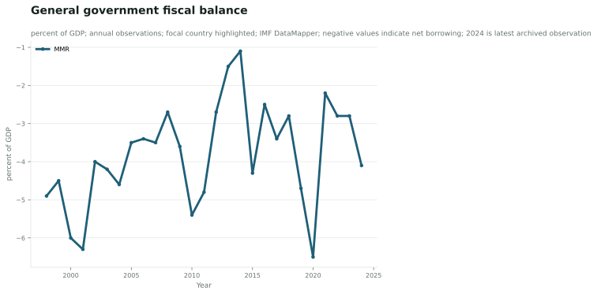
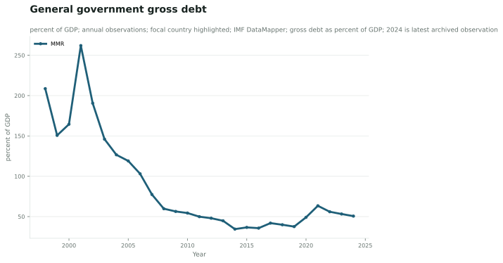
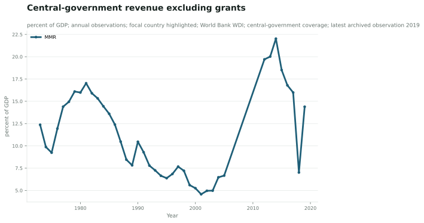
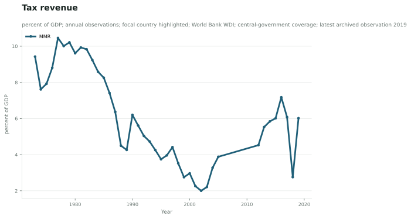
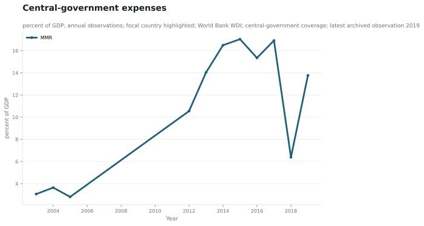
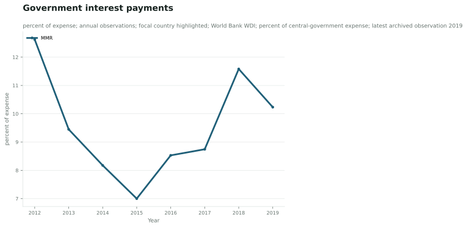

## 7.2 Fiscal Balance, Debt, and Interest Burden

### 7.2 Revenue, Expenditure, Fiscal Balance, and Debt

The statistical appendix uses two separate evidence layers. The IMF DataMapper series represent general-government revenue, fiscal balance and gross debt; the intended general-government expenditure series could not be recovered from the authoritative endpoint in this batch. The World Bank WDI series represent central-government revenue excluding grants, tax revenue, expenses and interest payments. These indicators are not merged because their institutional coverage and definitions differ.

In the archived IMF series, general-government revenue is 15.6 percent of GDP in 2024, compared with 14.8 percent in 2020 and 15.8 percent in 2019. The fiscal-balance series records -4.1 percent of GDP in 2024, compared with -6.5 percent in 2020 and -4.7 percent in 2019. General-government gross debt is 50.6 percent of GDP in 2024, compared with 49.1 percent in 2020 and 37.6 percent in 2019 (International Monetary Fund, 2026; indicators `rev`, `GGXCNL_NGDP` and `GGXWDG_NGDP`). The expenditure series remains unresolved because its exact IMF raw payload could not be archived.

These figures describe a broad fiscal envelope rather than audited national accounts. The archived IMF payload does not preserve a field distinguishing historical observations from estimates or projections. The appendix therefore excludes later observations and labels the latest IMF values as status-uncertain international data. The reproducible series show revenue, fiscal-balance and debt pressure, but they do not identify the causal contribution of conflict, sanctions, exchange-rate changes, public-enterprise operations or changes in statistical coverage.

The World Bank historical layer ends earlier. In 2019, central-government revenue excluding grants is 14.4 percent of GDP, tax revenue is 6.0 percent of GDP, and government expenses are 13.8 percent of GDP. Government interest payments are 10.2 percent of central-government expense (World Bank, 2026; indicators `GC.REV.XGRT.GD.ZS`, `GC.TAX.TOTL.GD.ZS`, `GC.XPN.TOTL.GD.ZS` and `GC.XPN.INTP.ZS`). These values are reproducible from the recovered raw payloads and useful for historical comparison, but they cannot be presented as current post-2021 fiscal performance.

The two datasets answer different questions. The IMF series offers a more recent broad public-sector signal but carries estimate-status and coverage limitations. The World Bank series offers a historical central-government view with a clearly older endpoint in the archived package. Neither substitutes for Myanmar's budget execution reports or final accounts. The most defensible conclusion is therefore that Myanmar's fiscal space is constrained in the available international series, while the precise current composition and execution of public finance remain underdocumented.

*Figures. Reproducible international fiscal indicators. Sources: MMR-IMF-DATAMAPPER-FISCAL-2026 and MMR-WB-WDI-FISCAL-2026. Reference periods and units are stated in the chart metadata. Caveat: IMF estimate/projection status is not fully preserved; `exp` is excluded.*

