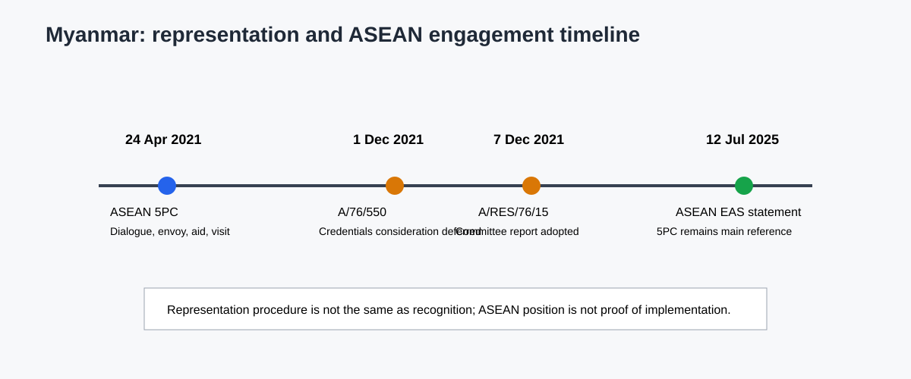

## 15.1 Foreign Policy and Regional Positioning

### 15.1 Foreign-Relations Institutions and Diplomatic Representation

Myanmar's formal external-relations architecture is concentrated at the Union level. The 2008 Constitution identifies the President as the executive head of the Union and places the Ministry of Foreign Affairs within the National Defence and Security Council (NDSC) structure (Articles 199-201, PDF pp. 84-85). The Constitution assigns the President authority to establish or sever diplomatic relations with foreign countries, subject to Pyidaungsu Hluttaw approval, with a limited immediate-action procedure involving the NDSC (Article 206, PDF p. 85). It also assigns the President the authority to appoint and recall diplomats, accept foreign diplomats' letters of accreditation, and enter into or ratify treaties according to the approval requirements set out in Article 209 (PDF pp. 86) (Republic of the Union of Myanmar, 2008).

Foreign affairs is also a Union legislative matter. Schedule One places diplomatic and consular affairs, the United Nations, international and regional conferences, and the conclusion and implementation of international treaties and agreements within the Foreign Affairs Sector of the Union Legislative List (PDF pp. 200-201). This creates a clear formal chain: Union constitutional authority, executive and legislative approval where required, and diplomatic representation through the Union's foreign-affairs machinery. It does not, by itself, answer which actor exercises effective authority after February 2021 or how external partners distinguish legal representation from practical engagement.

That distinction became visible in the UN credentials process. The Credentials Committee's 2021 report records competing communications concerning Myanmar's representation and deferred consideration of the credentials pending broader guidance. The General Assembly subsequently adopted the committee's report without a substantive resolution of the competing claim (A/76/550, paras. 7-9; A/RES/76/15; United Nations General Assembly Credentials Committee, 2021; United Nations General Assembly, 2021). The defensible conclusion is therefore procedural: the UN maintained an unresolved representation question in that session. The documents do not establish that the UN recognized the SAC, recognized the NUG, or recognized neither as a government. Representation, recognition, and working contact are different categories.

### 15.4 ASEAN and International Diplomatic Engagement

ASEAN's formal response is anchored in the Five-Point Consensus agreed at the ASEAN Leaders' Meeting on 24 April 2021. The statement calls for an immediate cessation of violence, constructive dialogue among all parties, mediation by an ASEAN Chair's special envoy with support from the Secretary-General, humanitarian assistance through the AHA Centre, and a visit by the special envoy and delegation (ASEAN, 2021). The document therefore provides a clear institutional mechanism, not merely a general expression of concern.

The mechanism's analytical significance lies in its combination of political and humanitarian instruments. ASEAN's approach does not replace Myanmar's constitutional foreign-affairs architecture, and the statement does not settle questions of recognition or domestic legitimacy. It creates a regional engagement framework whose effectiveness depends on access, consent, mediation conditions and member-state coordination. These implementation conditions belong in the analysis rather than being assumed from the existence of the consensus.

ASEAN's 2025 East Asia Summit Foreign Ministers' statement continues to treat the Five-Point Consensus as the main reference for addressing Myanmar's political crisis and expresses concern about violence and the humanitarian situation (ASEAN, 2025). This later statement supports continuity in ASEAN's declared framework. It does not establish that the consensus was fully implemented or that all ASEAN members adopted identical diplomatic tactics. Formal ASEAN position, member-state variation and observed implementation therefore remain separate analytical layers.

*Figure. ASEAN engagement and UN representation procedures. Sources: MMR-ASEAN-5PC-2021; MMR-UN-A76-550-2021; MMR-UN-ARES-76-15-2021. Reference period: 2021–2025. Caveat: representation and engagement do not establish recognition.*

