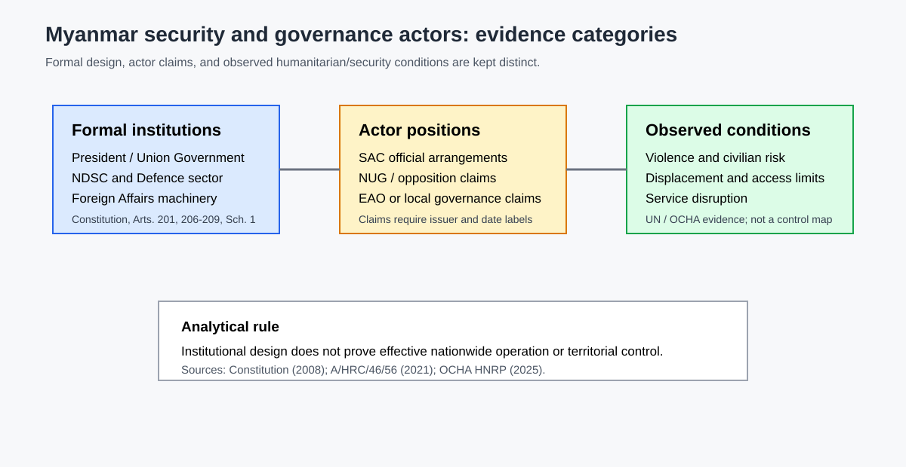
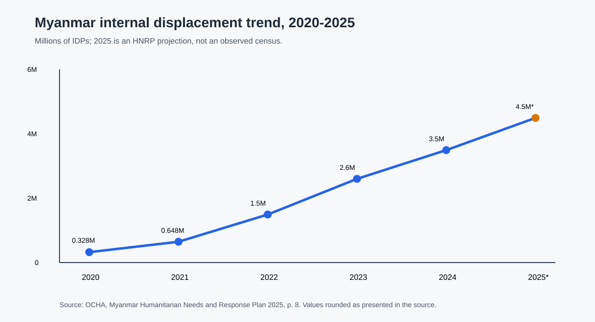

## 15.2 Borders, Internal Security, and Transnational Risks

### 15.2 Domestic Security Structure and the Post-2021 Conflict Environment

The constitutional security structure gives the armed forces a direct place in the Union's highest security institution. Article 201 includes the Commander-in-Chief and Deputy Commander-in-Chief in the NDSC alongside the President, Vice-Presidents, parliamentary speakers and ministers for Defence, Foreign Affairs, Home Affairs and Border Affairs. Schedule One places defence, declaration of war and peace, Union stability and law and order, and the police force in the Union Defence and Security Sector (Republic of the Union of Myanmar, 2008). These provisions describe formal institutional design. They do not establish effective nationwide security administration, nor do they settle the political status of post-2021 competing authorities.

For the post-2021 period, the evidence is organized by status. SAC statements and official records are evidence of SAC positions and claimed institutional arrangements. NUG and other opposition statements are evidence of their own institutional claims. UN reporting provides an external account of violence, rights conditions and civilian impact, but it is not a complete administrative map. Ethnic armed organizations and local governance bodies are distinct actor categories where documented; their different histories, mandates or territorial reach cannot be collapsed into one “non-state” category.

The Special Rapporteur's 2021 report supplies an early independent assessment of the human-rights and security situation after the military takeover (United Nations Human Rights Council, 2021). OCHA's 2025 Humanitarian Needs and Response Plan supplies a later planning frame in which conflict, disasters, economic and political instability, protection risks and service disruption interact (OCHA, 2024). Together, these sources support a mechanism-focused conclusion: security fragmentation affects civilian movement, humanitarian access and service delivery. They do not support a single national percentage for territorial control.

### 15.3 Neighbouring States and Border Relations

Myanmar's neighbourhood matters through several channels rather than through a single geopolitical alignment. China, Thailand, India, Bangladesh and Laos are relevant because borders connect security conditions to trade, migration, humanitarian access, infrastructure and armed-conflict spillovers. The present evidence package does not justify equal or detailed treatment of all five relationships. Nor does a diplomatic meeting, border incident or infrastructure project by itself establish a settled national policy.

The safer analytical structure is to examine each relationship through a dated mechanism matrix: the formal counterpart, the practical channel, the security or humanitarian consequence, and the evidence's time horizon. Border relations may involve state-to-state diplomacy, local authorities, armed organizations, humanitarian agencies and commercial actors simultaneously. This is especially important for Myanmar because a formal Union position may coexist with varied local operating conditions. Official foreign-ministry or neighbouring-government records are appropriate for stated policy, UN or humanitarian records for observed access and displacement, and specialized research for interpretation.

The 2025 HNRP demonstrates why border and security analysis cannot be separated from humanitarian operations. It describes access constraints, movement restrictions and interference by armed actors as operational conditions affecting assistance (OCHA, 2024). Such evidence can support a claim about the transmission mechanism from insecurity to humanitarian delivery. It cannot be used to infer that any one neighbour controls, recognizes or directs a particular territory without direct evidence.

### 15.5 Humanitarian, Displacement, and Security Implications

The OCHA 2025 HNRP gives the clearest locally archived humanitarian baseline for this candidate. Issued in December 2024 for the 2025 planning cycle, it estimates 19.9 million people in need of humanitarian assistance, including 6.3 million children and 7.1 million women. It estimates almost 3.5 million internally displaced people and identifies 15.2 million people facing acute food insecurity. The plan targets 5.5 million people and requests US$1.1 billion (OCHA, 2024). These figures are planning estimates for specified population definitions and dates; they are not a substitute for a current population census and cannot be merged with refugee or asylum-seeker totals.

The HNRP is analytically useful because it connects numbers to operational mechanisms. Its crisis overview links displacement and humanitarian need to armed conflict, disasters, epidemics, explosive ordnance, economic collapse and political instability. Its planning sections describe access and operational-capacity constraints, while the cluster architecture shows how education, food security, health, nutrition, protection, shelter and WASH are organized in the response. This makes the humanitarian dimension relevant to foreign relations and security: international engagement is mediated through access negotiations, funding, local partners, coordination systems and the safety of affected populations.

The evidence also cautions against treating displacement as a single national security statistic. IDPs are displaced within Myanmar; refugees and asylum-seekers are separate populations; returnees and stateless people have distinct definitions in the HNRP. The population category, reference date and source remain explicit for each figure. Humanitarian reach varies with access and operational capacity, but that variation is not converted into a territorial-control map.

*Figure. Security and governance actor categories. Sources: MMR-LEGAL-CONST-2008-FOREIGN-SECURITY; MMR-UN-AHRC-46-56-CH15; MMR-OCHA-HNRP-2025. Reference period: formal design 2008; observed context 2021–2025. Caveat: not a territorial-control map.*

*Figure. Humanitarian displacement trend and planning estimate. Source: MMR-OCHA-HNRP-2025, p. 8. Reference period: 2020–2025 planning cycle. Caveat: population definitions and planning estimates must not be combined with refugee or asylum-seeker totals.*

