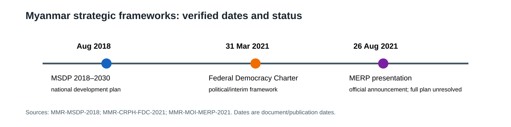

## 16.1 Evolution of National Development Strategy

### 16.1 Pre-2021 Development Strategy and Planning Architecture

The clearest pre-2021 national strategy in the verified archive is the *Myanmar Sustainable Development Plan (2018–2030)* (MSDP), issued by the Ministry of Planning and Finance in August 2018. It was designed as an umbrella framework for existing sectoral, ministerial and subnational plans rather than as a narrow sector programme. Its stated vision linked peace, prosperity and democracy, and its summary framework organized the plan around five goals: peace, national reconciliation, security and good governance; economic stability and strengthened macroeconomic management; job creation and private-sector-led growth; human resources and social development; and natural resources and the environment. These goals were grouped into three pillars: Peace and Stability; Prosperity and Partnership; and People and Planet (MMR-MSDP-2018, pp. i–v).

The MSDP’s analytical importance lies in the mechanism it proposed for coordinating policy. Each goal contained strategies, each strategy contained action plans, and the combined structure was presented as an implementation matrix. The foreword also proposed screening major projects for strategic alignment and creating a Project Bank to improve prioritization and transparency. This makes the document useful for identifying the intended planning chain: national vision, goals, strategies, action plans, project selection, coordination, resource mobilization, and monitoring. It does not, by itself, show that the chain operated as designed.

The plan also embedded conflict sensitivity and territorial differentiation in its architecture. Its contents include strategies on Union-wide peace, socio-economic development across States and Regions, administrative decision-making, macroeconomic management, human development, land and natural resources, cities, water, energy and climate resilience. The breadth is therefore substantive, but it also creates an evaluation problem: a single national plan covers policy areas whose responsible ministries, subnational partners, financing, and security conditions differ greatly. The plan’s intended coordination function is distinct from implementation, which requires domain-specific evidence rather than treating adoption as evidence of delivery.

*Figure. Dated strategic frameworks. Sources: MMR-MSDP-2018; MMR-MOI-MERP-2021; MMR-CRPH-FDC-2021. Reference period: 2018–2021. Caveat: the frameworks are not shown as a verified succession or performance ranking.*

