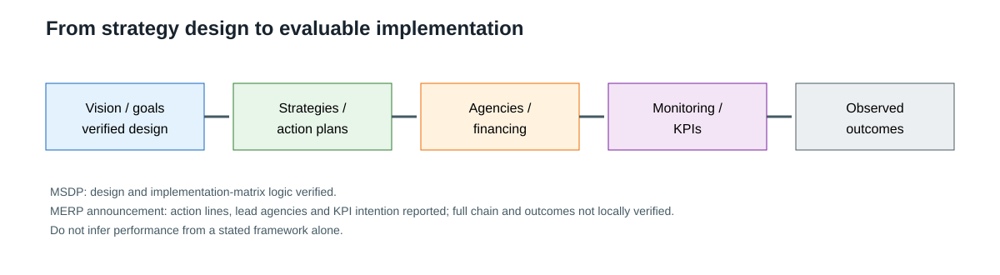
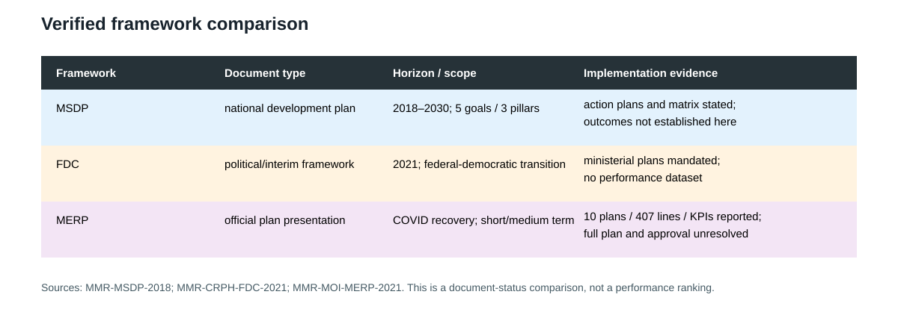

## 16.2 Current Development Plan and Policy Architecture

### 16.2 Post-2021 SAC Policy and Strategic Framework

The available official post-2021 evidence is narrower. A Ministry of Information announcement dated 26 August 2021 reported a final consultation and presentation of the Myanmar Economic Recovery Plan (MERP). It states that the plan was formulated with reference to the SDGs, the ASEAN Comprehensive Recovery Framework, the Greater Mekong Sub-region COVID-19 Response and Recovery Plan for 2021–2023, and the State Administration Council’s roadmap and economic objectives (MMR-MOI-MERP-2021).

The same announcement reports that MERP contained 10 Action Plans, 27 Expectations and 407 Action Lines. It also says the framework was intended to remain a living document, to be linked to a long-term National Plan, and to use lead and implementing agencies, key performance indicators, and monitoring and evaluation. The announcement records that participants discussed the draft and decided to proceed with procedures for further approval. This wording supports a carefully limited conclusion: MERP was publicly presented by SAC-associated officials as an economic-recovery framework with a proposed implementation and monitoring architecture. The local evidence does not support describing the announcement as the full approved plan, nor does it establish implementation or results.

This distinction matters for the relationship between MSDP and MERP. MERP appears, in the official announcement, as a shorter-term recovery framework that was to connect to a longer-term National Plan. The announcement does not establish whether the MSDP remained the operative umbrella, was revised, or was displaced. That institutional continuity question remains unresolved; the relationship is therefore an official planning claim and an open question, not a demonstrated succession.

### 16.3 CRPH/NUG/Federal-Democratic Strategic Framework

The Federal Democracy Charter (FDC), issued in 2021 and archived locally as a CRPH source, is a different kind of strategic instrument. Part I sets a political objective of building a Federal Democracy Union and describes values including democracy, human rights, equality, self-determination, collective leadership and minority rights. It provides principles for allocating Union, State and concurrent powers and refers to fiscal management and revenue-sharing laws between the Federal Union and States. It also addresses natural-resource governance, security, public services and administrative training (MMR-CRPH-FDC-2021, Part I, PDF pp. 3–8).

Part II describes an interim constitutional arrangement. It sets the objective of forming an Interim National Unity Government, establishing its structure and authority, protecting rights during the interim period, and preparing a future Federal Democracy Union Constitution. It gives the interim government a mandate to develop and implement ministerial plans and to use political, economic, social, foreign-affairs, defense and security approaches. It also provides for coordination through the National Unity Consultative Council and for a constitutional convention (MMR-CRPH-FDC-2021, Part II, PDF pp. 3–7).

The FDC is relevant to Chapter 16 because it articulates an alternative policy and state-building pathway in which development is linked to federal restructuring, rights, self-determination, fiscal equality and local participation. It belongs to a different category from the MSDP or MERP. The available text is a political and interim constitutional framework; it is not a verified national budget, sector plan, implementation matrix, or performance report. Statements about its proposed strategy are attributed to the Charter and kept separate from observed governance or service delivery.

### 16.5 Continuity, Rupture and Competing Development Pathways

There is limited evidence of thematic continuity. MSDP and the MERP announcement both refer to macroeconomic stability, economic recovery, coordination across ministries and alignment with broader international or regional frameworks. The MERP announcement’s reference to a long-term National Plan also suggests an intended planning connection. Yet the evidence does not show whether the institutions, targets, financing and monitoring arrangements were carried forward. Continuity is therefore an official or thematic possibility, not a verified administrative fact.

There is clearer evidence of political rupture in the strategic framing. MSDP presents a national development vision that joins peace, prosperity and democracy under a common plan. The FDC presents a post-2021 alternative in which ending dictatorship, building federal democracy, protecting rights and developing a new constitutional order are prerequisites for the future state. MERP presents recovery in relation to the SAC roadmap and economic objectives. These frameworks do not merely differ in sector emphasis; they attach development to competing institutional and political projects.

The resulting policy environment is best represented as plural and contested. Formal documents describe intended pathways, while administrative reach, fiscal capacity, security conditions and international engagement determine where any pathway can be implemented. No framework can be declared nationally effective unless evidence establishes reach and operation across the relevant territory and population.

*Figure. Strategy design and implementation evidence chain. Sources: MMR-MSDP-2018; MMR-MOI-MERP-2021; MMR-CRPH-FDC-2021. Reference period: 2018–2021 frameworks. Caveat: MERP is an official announcement/presentation, not a verified full approved plan.*

*Figure. Comparison of verified strategic frameworks. Sources: MMR-MSDP-2018; MMR-MOI-MERP-2021; MMR-CRPH-FDC-2021. Caveat: document-status comparison, not implementation or performance ranking.*

