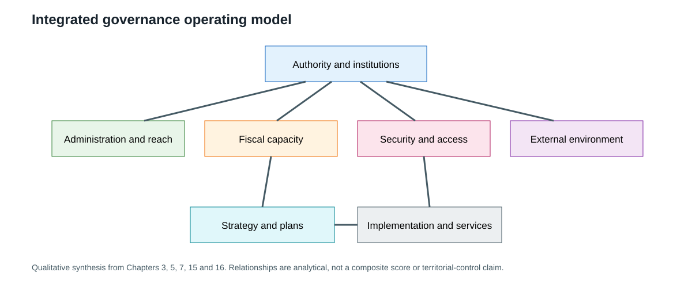

## 17.1 National Operating Model

### 17.1 Authority and Institutional Coherence

Myanmar’s governing order cannot be described adequately by choosing either the formal constitutional text or post-2021 operating claims as the whole story. Chapter 3 establishes the 2008 Constitution’s institutional design and documents the legal language used in the 1 February 2021 emergency declaration, the transfer-of-powers claim, and the subsequent formation of the State Administration Council. Those documents are evidence of formal rules and official claims. They do not independently settle the contested authority question (Republic of the Union of Myanmar, 2008; Office of the President, 2021; Office of the Commander-in-Chief of Defence Services, 2021).

The Federal Democracy Charter provides a second framework. It describes an interim constitutional arrangement, an Interim National Unity Government, a future federal constitution and a political programme linking institutional reconstruction to political, economic, social, diplomatic, defence and security action. Its status is that of an alternative political and interim framework, not a universally operative constitutional order. The coexistence of these frameworks is therefore best understood as authority fragmentation with different levels and types of institutional evidence (Committee Representing Pyidaungsu Hluttaw, 2021).

This fragmentation affects coherence through the chain of authorization. A ministry, budget, administrative instruction or strategic plan may have a clear formal location within one institutional framework while its effective reach, compliance and recognition vary by locality and actor. The terms “formal authority,” “official claim,” “contested authority” and “observed operation” therefore remain separate analytical categories. A unified national conclusion would be stronger than the underlying evidence.

### 17.6 Integrated Governance Assessment

Across the verified chapters, Myanmar’s operating environment is characterized by interaction among five conditions: a formal constitutional and administrative architecture; contested post-2021 authority; uneven administrative and security reach; constrained and incompletely observed fiscal capacity; and competing strategic frameworks. These findings interact as constraints. Authority contestation can affect coordination; fragmented administration can affect service delivery; insecurity can restrict implementation conditions; fiscal uncertainty limits what can be inferred about resources; and incomplete monitoring makes strategy performance difficult to evaluate.

The same interaction also limits broad conclusions. Formal institutions remain analytically relevant because they identify legal authority, organizational responsibilities and intended procedures. They do not establish effective operation everywhere. Aggregate fiscal indicators remain useful because they provide comparable signals, but they do not identify local collection, spending or conflict-finance systems. Diplomatic engagement remains consequential, but it does not equal recognition. Strategic documents clarify intended pathways, but they do not prove implementation.

The integrated assessment is consequently best expressed as a qualified operating model: formal order persists as a reference structure, while actual governance depends on contested authority, variable reach, available personnel and resources, security conditions, external access and the quality of monitoring. This formulation explains institutional interaction without declaring nationwide control or assigning an unsupported composite capacity score.

*Figure. Integrated governance operating model. Sources: Chapters 3, 5, 7, 15 and 16. Reference period: primarily post-2021, with formal structures dated to source periods. Caveat: analytical interaction, not a quantified causal model or territorial-control claim.*

