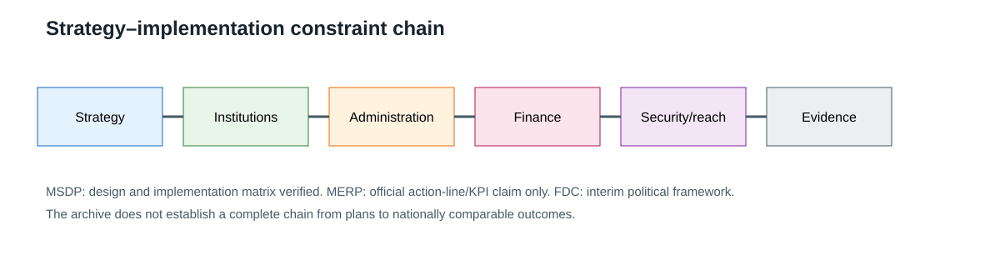
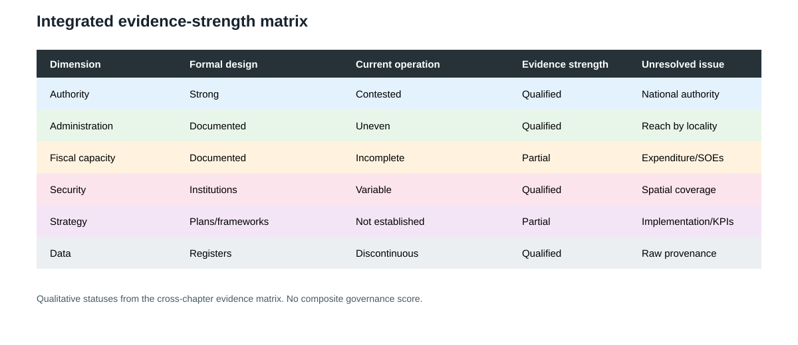

## 17.5 Strategic Outlook

### 17.5 Strategy–Implementation Capacity

Chapter 16 identifies three different strategic instruments. The MSDP is a verified 2018–2030 national development plan with goals, pillars, strategies, action plans and an implementation matrix. The 2021 MERP evidence is an official announcement describing a recovery framework with action plans, action lines and intended KPIs; the full plan, approval and results are not verified. The Federal Democracy Charter is an alternative political and interim constitutional framework that mandates ministerial and governance plans while pursuing federal-democratic reconstruction (Ministry of Planning and Finance, 2018; Ministry of Information, 2021; Committee Representing Pyidaungsu Hluttaw, 2021).

These instruments create a strategy–implementation chain: stated vision, responsible institutions, administrative machinery, fiscal resources, security and territorial conditions, monitoring, and observable outcomes. The chain is only partly evidenced. MSDP documents the design of the chain. MERP’s announcement describes an intended chain. Chapters 5 and 7 document why institutions, reach and resources require separate verification. The available archive does not establish which plans were funded, implemented, monitored or continued after 2021 (Ministry of Planning and Finance, 2018; Ministry of Information, 2021; Committee Representing Pyidaungsu Hluttaw, 2021).

The strongest integrated finding is therefore a gap between strategic design and evaluable implementation. This is not a claim that every policy failed. It is a statement about what the evidence can currently establish. A plan, official target or announced KPI is not an observed outcome, and macroeconomic or humanitarian conditions cannot be attributed to a strategy without a baseline, target, implementation record and attribution method.

### 17.7 Evidence Limitations and Forward-Looking Implications

The evidence base is strongest for formal documents and selected international or institutional diagnostics. It is weaker for current territorial reach, local fiscal operation, strategy implementation, and comparable outcomes across areas governed or served by different authorities. Statistical discontinuities and missing raw provenance require historical/current distinctions. Humanitarian estimates describe defined response plans rather than complete administrative statistics (International Monetary Fund, 2026; World Bank, 2026; United Nations Human Rights Council, 2021; OCHA, 2024).

For later policy analysis, the practical implication is to examine the chain between authority, administration, finance, security, strategy and monitoring at the level where evidence can be verified. A reliable assessment records the reference date, actor, locality, population definition, source type and uncertainty for each major claim, while preserving the distinction between formal institutional reform and effective service delivery. These are methodological implications of the evidence, not a substitute for unresolved research.

### References

ASEAN. (2021, April 24). *Chairman’s Statement on the ASEAN Leaders’ Meeting on the Five-Point Consensus on the Situation in Myanmar*.

ASEAN. (2025, July 12). *Chairman’s Statement of the 15th East Asia Summit Foreign Ministers’ Meeting*.

Committee Representing Pyidaungsu Hluttaw. (2021). *Federal Democracy Charter*.

International Monetary Fund. (2026). *IMF DataMapper fiscal series for Myanmar*.

Kyi Pyar Chit Saw, & Arnold, M. (2014). *Administering the State in Myanmar: An overview of the General Administration Department*.

Ministry of Information. (2021, August 26). *Myanmar Economic Recovery Plan-MERP final consultation and presentation led by Working Committee to address the impact of COVID-19 on national economy*.

Ministry of Planning and Finance. (2018, August). *Myanmar Sustainable Development Plan (2018–2030)*.

OCHA. (2024, December). *Myanmar Humanitarian Needs and Response Plan 2025*.

Republic of the Union of Myanmar. (2008). *Constitution of the Republic of the Union of Myanmar*.

The Asia Foundation. (2019). *State and Region Governments in Myanmar*.

United Nations General Assembly. (2021). *Credentials of representatives to the seventy-sixth session of the General Assembly* (A/RES/76/15).

United Nations General Assembly Credentials Committee. (2021). *Report of the Credentials Committee* (A/76/550).

United Nations Human Rights Council. (2021). *Report of the Special Rapporteur on the situation of human rights in Myanmar* (A/HRC/46/56).

World Bank. (2026). *World Development Indicators fiscal series for Myanmar*.

*Figure. Strategy–implementation constraint pathway. Sources: Chapters 5, 7 and 16. Caveat: analytical constraint pathway, not measured causality.*

*Figure. Integrated evidence-strength matrix. Sources: Chapters 3, 5, 7, 15 and 16. Reference period: source-specific. Caveat: qualitative evidence status only; no composite score or ranking.*

